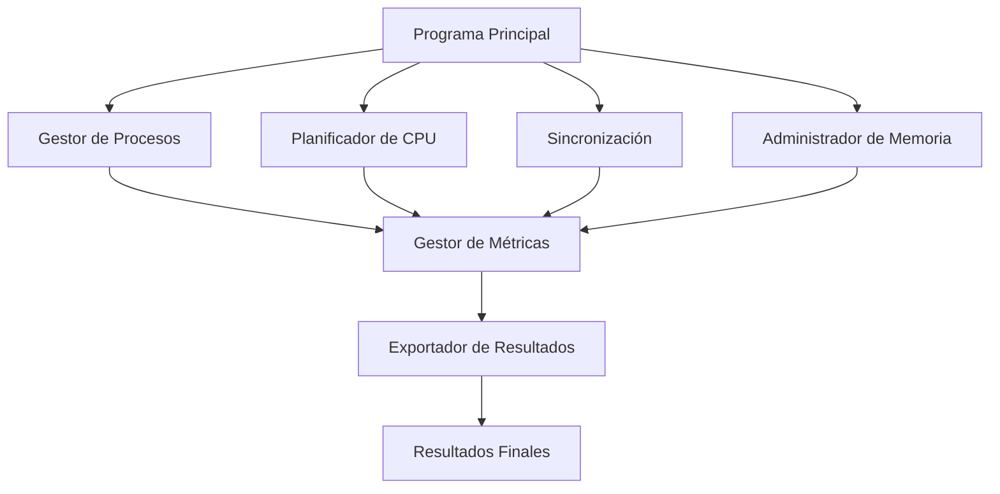

# Arquitectura del Sistema

# SIMGESRC

## Sistema de Gestión de Recursos Computacionales para la Plataforma Bancaria Digital de Caja Huancayo

---

## Descripción

El **Sistema de Gestión de Recursos Computacionales para la Plataforma Bancaria Digital de Caja Huancayo (SIMGESRC)** es un simulador académico desarrollado como proyecto integrador de la asignatura de **Sistemas Operativos** de la Universidad Peruana Los Andes.

El objetivo principal del proyecto consiste en representar el funcionamiento interno de un sistema operativo moderno dentro de un escenario inspirado en una plataforma bancaria digital, integrando los principales mecanismos de administración de recursos computacionales.

A diferencia de una aplicación bancaria real, SIMGESRC no procesa transacciones financieras reales ni mantiene comunicación con servidores externos. El proyecto constituye una simulación académica cuyo propósito es demostrar el comportamiento de los mecanismos fundamentales estudiados durante el curso, permitiendo observar cómo un sistema operativo administra procesos, memoria y recursos compartidos bajo diferentes condiciones de carga.

La arquitectura fue diseñada utilizando un enfoque modular, facilitando la separación de responsabilidades entre cada componente del sistema, permitiendo realizar pruebas independientes y simplificando el mantenimiento del código fuente.

---

# Objetivos de la Arquitectura

La arquitectura del simulador fue diseñada para cumplir los siguientes objetivos:

- Representar el funcionamiento interno de un sistema operativo moderno.
- Simular una plataforma bancaria con múltiples procesos concurrentes.
- Integrar planificación de CPU, concurrencia y administración de memoria.
- Mantener independencia entre cada módulo del sistema.
- Facilitar la ampliación futura del proyecto.
- Permitir la evaluación individual de cada algoritmo implementado.
- Centralizar el cálculo de métricas de desempeño.
- Exportar automáticamente los resultados obtenidos durante la simulación.

---

# Escenario del Proyecto

El escenario seleccionado corresponde a una plataforma bancaria digital inspirada académicamente en Caja Huancayo.

En este entorno, numerosos usuarios realizan simultáneamente operaciones financieras mediante aplicaciones web y móviles, generando una carga importante de solicitudes que deben ser administradas correctamente por el sistema operativo.

Durante la simulación se representan operaciones típicas como:

- Inicio de sesión de usuarios.
- Consultas de saldo.
- Transferencias bancarias.
- Pagos de servicios.
- Actualización de registros.
- Operaciones administrativas.
- Liquidaciones nocturnas.

Cada proceso posee diferentes características de ejecución, permitiendo representar un escenario heterogéneo donde existen procesos interactivos, procesos batch y operaciones que requieren distintos niveles de prioridad.

Esta diversidad permite evaluar el comportamiento de los algoritmos implementados y analizar cómo afectan el rendimiento general del sistema.

---

# Características del Escenario

El escenario utilizado por SIMGESRC presenta las siguientes características:

| Característica       | Descripción                        |
| -------------------- | ---------------------------------- |
| Dominio              | Plataforma bancaria digital        |
| Usuarios             | Múltiples usuarios concurrentes    |
| Tipo de carga        | Mixta (CPU e I/O)                  |
| Procesos             | Interactivos y Batch               |
| Recursos compartidos | Memoria, CPU y estructuras comunes |
| Concurrencia         | Mediante POSIX Threads             |
| Sincronización       | Mutex                              |
| Gestión de memoria   | Particiones variables              |
| Sistema operativo    | Ubuntu Desktop 24.04 LTS           |

---

# Procesos Representados

El simulador utiliza procesos representativos de un sistema bancario.

Cada proceso incorpora atributos utilizados por los algoritmos de planificación.

Entre ellos:

- Identificador.
- Nombre.
- Tiempo de llegada.
- Tiempo de ejecución.
- Prioridad.
- Memoria requerida.
- Estado.
- Tiempo restante.
- Tiempo de espera.
- Tiempo de respuesta.
- Tiempo de retorno.

Los procesos simulados representan diferentes comportamientos para permitir comparar el rendimiento de los algoritmos implementados.

---

# Tipo de Sistema Operativo Seleccionado

El proyecto fue desarrollado utilizando:

```text
Ubuntu Desktop 24.04 LTS
```

Ubuntu pertenece a la familia GNU/Linux y proporciona un entorno adecuado para el desarrollo de aplicaciones en lenguaje C debido a su estabilidad, seguridad y compatibilidad con herramientas profesionales.

La selección de este sistema operativo responde a las necesidades del simulador y a los objetivos académicos del proyecto.

---

# Justificación Técnica

Ubuntu Desktop fue seleccionado por las siguientes razones:

## Compatibilidad POSIX

El estándar POSIX permite utilizar mecanismos avanzados de programación concurrente mediante la biblioteca **pthread**, utilizada durante la implementación del simulador.

Gracias a esta compatibilidad fue posible desarrollar:

- Hilos.
- Mutex.
- Sincronización.
- Exclusión mutua.
- Secciones críticas.

---

## Compilador GCC

Ubuntu incorpora de forma nativa el compilador GNU Compiler Collection (GCC).

El proyecto fue desarrollado utilizando el estándar:

```text
C11
```

La compilación puede realizarse mediante:

```bash
gcc -std=c11 -Wall -Wextra -pthread simgesrc.c -o simgesrc
```

o mediante el archivo:

```text
Makefile
```

incluido en el repositorio.

---

## Herramientas de Desarrollo

Ubuntu proporciona un entorno completo para el desarrollo del simulador.

Entre las herramientas utilizadas se encuentran:

- GCC.
- Make.
- Bash.
- Terminal Linux.
- Visual Studio Code.
- Biblioteca POSIX Threads.

Estas herramientas permiten compilar, ejecutar y analizar el comportamiento del sistema.

---

## Estabilidad

Ubuntu Desktop 24.04 LTS corresponde a una versión con soporte de largo plazo (LTS).

Esto garantiza un entorno estable para realizar:

- Desarrollo.
- Pruebas.
- Compilación.
- Ejecución del simulador.

---

## Seguridad

Linux implementa mecanismos internos de protección que permiten administrar correctamente:

- Procesos.
- Memoria.
- Permisos.
- Archivos.
- Recursos del sistema.

Estas características proporcionan un entorno adecuado para desarrollar aplicaciones relacionadas con Sistemas Operativos.

---

## Enfoque Académico

Ubuntu permite representar de manera práctica conceptos fundamentales como:

- Planificación del procesador.
- Gestión de procesos.
- Administración de memoria.
- Concurrencia.
- Sincronización.
- Deadlocks.
- Gestión de recursos.

Por esta razón constituye una plataforma adecuada para el desarrollo del proyecto SIMGESRC.

---

# Clasificación del Sistema Operativo

Considerando el escenario implementado, Ubuntu puede clasificarse dentro de las siguientes categorías.

## Sistema Multiusuario

Permite que múltiples usuarios ejecuten procesos de forma simultánea manteniendo aislamiento entre ellos.

---

## Sistema Multitarea

Es capaz de ejecutar múltiples aplicaciones concurrentemente compartiendo el procesador.

Esta característica es representada mediante la ejecución simultánea de varios procesos bancarios.

---

## Sistema Multiproceso

Ubuntu puede aprovechar equipos con múltiples núcleos de procesamiento.

Esto resulta especialmente útil para la ejecución de hilos creados mediante POSIX Threads.

---

## Sistema de Tiempo Compartido

Las operaciones interactivas del escenario requieren tiempos de respuesta reducidos.

Por ello el simulador implementa algoritmos como Round Robin para representar este comportamiento.

---

## Procesamiento Batch

Procesos como la liquidación nocturna representan operaciones de larga duración que pueden ejecutarse sin interacción directa del usuario.

---

# Arquitectura de Hardware Propuesta

La arquitectura mínima propuesta para ejecutar correctamente el simulador es la siguiente.

| Componente        | Especificación              |
| ----------------- | --------------------------- |
| Procesador        | Intel Core i5 o equivalente |
| Memoria RAM       | 8 GB                        |
| Almacenamiento    | 20 GB libres                |
| Sistema Operativo | Ubuntu Desktop 24.04 LTS    |
| Compilador        | GCC                         |
| Lenguaje          | C11                         |
| Biblioteca        | POSIX Threads (pthread)     |

Esta configuración proporciona los recursos suficientes para ejecutar el simulador y realizar las pruebas definidas durante el desarrollo del proyecto.

---

# Recursos Utilizados

Durante la ejecución del simulador intervienen principalmente los siguientes recursos físicos.

## Procesador

Responsable de ejecutar los procesos simulados y aplicar los algoritmos de planificación.

## Memoria Principal

Utilizada por el sistema operativo y por el simulador durante la ejecución de los procesos.

## Almacenamiento

Empleado para almacenar:

- Código fuente.
- Ejecutables.
- Archivos TXT.
- Archivos CSV.
- Documentación.

## Sistema Operativo

Administra todos los recursos disponibles y proporciona la interfaz necesaria para ejecutar el simulador.

---

# Relación entre Hardware y Software

```text
                    Usuario
                       │
                       ▼
             Programa SIMGESRC
                       │
      ┌────────────────┼────────────────┐
      ▼                ▼                ▼
 Planificación     Concurrencia     Memoria
      │                │                │
      └────────────────┼────────────────┘
                       ▼
             Ubuntu Desktop 24.04 LTS
                       │
      ┌────────────────┼────────────────┐
      ▼                ▼                ▼
     CPU             RAM          Almacenamiento
```

**Figura 1. Relación entre el simulador, el sistema operativo y los recursos físicos.**

---

# Arquitectura del Kernel

Ubuntu utiliza una arquitectura basada en un **kernel monolítico modular**.

En este modelo, los principales servicios del sistema operativo se ejecutan dentro del espacio del núcleo, permitiendo una comunicación eficiente entre todos los componentes responsables de administrar los recursos del sistema.

Entre estos servicios destacan:

- Gestión de procesos.
- Administración de memoria.
- Planificación del procesador.
- Gestión de interrupciones.
- Sistemas de archivos.
- Comunicación entre procesos.
- Controladores de dispositivos.

Aunque el núcleo es monolítico, Linux permite cargar módulos dinámicamente, facilitando la ampliación de funcionalidades sin modificar la estructura principal del sistema.

Esta arquitectura proporciona el rendimiento y la estabilidad necesarios para ejecutar aplicaciones concurrentes como SIMGESRC.

---

> **Continúa en la Parte 2**, donde se desarrollará la arquitectura modular del simulador, los componentes principales, el flujo general del sistema y los diagramas técnicos en formato Mermaid para visualizar la estructura del proyecto.

---

# Arquitectura Propuesta del Sistema

El Sistema de Gestión de Recursos Computacionales para la Plataforma Bancaria Digital de Caja Huancayo (SIMGESRC) fue diseñado bajo una **arquitectura modular**, permitiendo separar claramente las responsabilidades de cada componente que participa durante la simulación.

La modularidad facilita el desarrollo, mantenimiento y ampliación del proyecto, ya que cada módulo puede evolucionar de manera independiente sin afectar el funcionamiento general del sistema.

Durante la ejecución del simulador, cada componente realiza una función específica dentro del proceso de administración de recursos computacionales, representando de forma práctica el comportamiento de un sistema operativo moderno.

El flujo de ejecución inicia en el programa principal, encargado de configurar el entorno de simulación, inicializar las estructuras de datos y coordinar la comunicación entre los diferentes módulos.

Posteriormente, los procesos simulados son enviados al planificador de CPU, donde serán administrados utilizando el algoritmo seleccionado por el usuario.

Durante la ejecución, el módulo de sincronización protege los recursos compartidos cuando múltiples procesos intentan acceder simultáneamente a ellos, mientras que el administrador de memoria asigna dinámicamente el espacio requerido utilizando los algoritmos First-Fit o Best-Fit.

Finalmente, el gestor de métricas recopila toda la información generada durante la simulación y el exportador de resultados almacena los datos obtenidos para su posterior análisis.

---

# Objetivos de la Arquitectura Modular

La arquitectura propuesta busca cumplir los siguientes objetivos:

- Separar responsabilidades entre los diferentes módulos.
- Facilitar el mantenimiento del código fuente.
- Permitir la integración de nuevos algoritmos.
- Reducir el acoplamiento entre componentes.
- Favorecer la reutilización del código.
- Facilitar la depuración y pruebas individuales.
- Centralizar el control del flujo de ejecución.
- Simplificar la generación de resultados.

---

# Componentes Principales

El simulador está compuesto por los siguientes módulos principales.

| Componente               | Función principal                                   |
| ------------------------ | --------------------------------------------------- |
| Programa principal       | Inicializa el sistema y coordina todos los módulos  |
| Gestor de procesos       | Crea y administra los procesos simulados            |
| Planificador de CPU      | Ejecuta los algoritmos de planificación             |
| Módulo de sincronización | Controla el acceso concurrente mediante mutex       |
| Administrador de memoria | Gestiona la memoria utilizando First-Fit y Best-Fit |
| Gestor de métricas       | Calcula indicadores de rendimiento                  |
| Exportador de resultados | Genera archivos TXT y CSV con los resultados        |

---

# Programa Principal

El programa principal constituye el punto de entrada del simulador.

Entre sus responsabilidades se encuentran:

- Inicializar la simulación.
- Configurar los parámetros generales.
- Crear la carga de trabajo.
- Mostrar el menú principal.
- Coordinar la ejecución de cada módulo.
- Invocar el algoritmo seleccionado.
- Controlar el flujo completo del sistema.
- Finalizar correctamente la simulación.

Este módulo actúa como el controlador central del proyecto.

---

# Gestor de Procesos

El gestor de procesos administra toda la información relacionada con los procesos simulados.

Cada proceso contiene información utilizada posteriormente por los algoritmos de planificación.

Entre los atributos principales se encuentran:

- Identificador.
- Nombre.
- Tiempo de llegada.
- Ráfaga de CPU.
- Prioridad.
- Memoria requerida.
- Estado.
- Tiempo restante.
- Tiempo de inicio.
- Tiempo de finalización.
- Tiempo de espera.
- Tiempo de respuesta.
- Tiempo de retorno.

El gestor es responsable de mantener organizada esta información durante toda la simulación.

---

# Planificador de CPU

El planificador representa uno de los componentes principales del simulador.

Su función consiste en decidir el orden en que los procesos obtienen acceso al procesador.

El proyecto incorpora cuatro algoritmos clásicos de planificación:

## First Come First Served (FCFS)

Ejecuta los procesos respetando estrictamente el orden de llegada.

Características:

- Muy sencillo.
- No apropiativo.
- Baja sobrecarga.
- Puede generar efecto convoy.

---

## Shortest Job First (SJF)

Selecciona el proceso disponible cuya ráfaga de CPU es menor.

Características:

- Reduce el tiempo promedio de espera.
- Requiere conocer previamente la duración estimada.
- Puede provocar inanición.

---

## Round Robin

Distribuye el tiempo del procesador mediante un quantum fijo.

En SIMGESRC:

```text
Quantum = 4
```

Características:

- Apropiativo.
- Equitativo.
- Adecuado para sistemas interactivos.
- Reduce el tiempo de respuesta.

---

## Prioridades con Aging

Los procesos son seleccionados según su prioridad.

Cuando un proceso permanece demasiado tiempo esperando, su prioridad aumenta automáticamente mediante la técnica denominada Aging.

Esto reduce significativamente la posibilidad de inanición.

---

# Módulo de Sincronización

Este módulo controla el acceso a los recursos compartidos.

Su implementación utiliza:

```c
pthread_mutex_t
```

Las funciones principales son:

- Proteger secciones críticas.
- Evitar condiciones de carrera.
- Garantizar exclusión mutua.
- Coordinar múltiples hilos.
- Mantener la consistencia de los datos.

El simulador compara el comportamiento del sistema con y sin sincronización.

---

# Administrador de Memoria

Este componente representa el comportamiento básico de un administrador de memoria con particiones variables.

Su función consiste en asignar memoria a cada proceso durante la simulación.

Los algoritmos implementados son:

## First-Fit

Busca el primer bloque libre con capacidad suficiente.

Ventajas:

- Muy rápido.
- Bajo costo computacional.
- Implementación sencilla.

Desventajas:

- Puede incrementar la fragmentación externa.

---

## Best-Fit

Busca el bloque libre más pequeño que pueda satisfacer la solicitud.

Ventajas:

- Mejor aprovechamiento del espacio.

Desventajas:

- Mayor tiempo de búsqueda.
- Puede producir bloques muy pequeños difíciles de reutilizar.

---

# Gestor de Métricas

Durante la ejecución del simulador se recopilan automáticamente diferentes indicadores de rendimiento.

Entre ellos:

- Tiempo promedio de espera (WT).
- Tiempo promedio de retorno (TAT).
- Tiempo promedio de respuesta (RT).
- Throughput.
- Utilización del procesador.
- Makespan.

Estos indicadores permiten comparar el rendimiento de los algoritmos implementados.

---

# Exportador de Resultados

Una vez finalizada la simulación, el sistema genera automáticamente archivos con los resultados obtenidos.

Los formatos utilizados son:

- TXT.
- CSV.

Estos archivos permiten realizar análisis posteriores sin necesidad de ejecutar nuevamente el simulador.

---

# Diagrama General de la Arquitectura



**Figura 2. Arquitectura modular del simulador SIMGESRC.**

---

# Flujo General del Sistema

La ejecución del simulador sigue una secuencia organizada que representa las principales actividades realizadas por un sistema operativo durante la administración de recursos.

Inicialmente el programa principal configura el entorno de simulación y genera automáticamente los procesos que participarán en la ejecución.

Cada proceso incorpora la información necesaria para ser administrado posteriormente por el planificador.

Después, el usuario selecciona el algoritmo de planificación que desea evaluar.

Durante la ejecución, los procesos pueden solicitar memoria, acceder a recursos compartidos y competir por el procesador.

Cuando dos o más hilos intentan acceder simultáneamente a un mismo recurso, interviene el módulo de sincronización utilizando mutex para garantizar la exclusión mutua.

Una vez completada la ejecución de todos los procesos, el sistema calcula las métricas correspondientes y genera los archivos de resultados.

---

# Flujo General del Simulador


**Figura 3. Flujo general de ejecución del simulador.**

---

# Interacción entre Componentes

Todos los módulos del simulador trabajan de forma coordinada.

El programa principal controla el flujo general.

El gestor de procesos proporciona la información al planificador.

El planificador determina qué proceso utilizará el procesador.

El administrador de memoria asigna el espacio requerido.

El módulo de sincronización protege los recursos compartidos.

Finalmente, el gestor de métricas recopila la información y el exportador genera los resultados finales.

Esta interacción permite representar de forma integrada el comportamiento interno de un sistema operativo moderno, manteniendo una arquitectura organizada, modular y fácilmente extensible.

---

> **Continúa en la Parte 3**, donde se desarrollan las ventajas de la arquitectura propuesta, la relación entre los módulos, las decisiones de diseño, las conclusiones del módulo y las referencias técnicas utilizadas.

---

# Decisiones de Diseño de la Arquitectura

Durante el desarrollo de SIMGESRC se adoptaron diversas decisiones de diseño con el objetivo de representar de forma clara y organizada el funcionamiento interno de un sistema operativo moderno.

Cada decisión fue tomada considerando los objetivos académicos del proyecto, la facilidad de mantenimiento del código y la posibilidad de ampliar el simulador con nuevos módulos en el futuro.

Las principales decisiones de diseño fueron las siguientes:

- Utilizar una arquitectura modular para separar responsabilidades.
- Implementar el simulador en lenguaje **C11**.
- Utilizar **GCC** como compilador principal.
- Ejecutar el proyecto sobre **Ubuntu Desktop 24.04 LTS**.
- Implementar concurrencia mediante **POSIX Threads**.
- Utilizar **pthread_mutex_t** para proteger recursos compartidos.
- Incorporar algoritmos clásicos de planificación de CPU.
- Implementar un administrador de memoria basado en particiones variables.
- Centralizar el cálculo de métricas de rendimiento.
- Exportar automáticamente los resultados obtenidos.

Estas decisiones permiten que el simulador sea comprensible, mantenible y coherente con los objetivos de la asignatura.

---

# Relación entre los Módulos

Aunque cada módulo puede ejecutarse y analizarse de forma independiente, todos forman parte de un único sistema integrado.

La interacción entre ellos puede resumirse de la siguiente manera:

```text
Gestor de Procesos
        │
        ▼
Planificador de CPU
        │
        ▼
Administrador de Memoria
        │
        ▼
Módulo de Sincronización
        │
        ▼
Gestor de Métricas
        │
        ▼
Exportador de Resultados
```

Cada componente recibe información del módulo anterior y produce resultados que serán utilizados por el siguiente.

Esta organización evita dependencias innecesarias y facilita la integración del sistema.

---

# Principios de Diseño Aplicados

La arquitectura del simulador sigue diversos principios utilizados en el desarrollo de software.

## Separación de responsabilidades

Cada módulo tiene una función claramente definida.

Ejemplos:

- El planificador únicamente administra la CPU.
- El administrador de memoria gestiona las particiones.
- El módulo de sincronización protege recursos compartidos.
- El gestor de métricas calcula indicadores.
- El exportador genera los archivos finales.

Esta separación facilita la comprensión del código.

---

## Modularidad

El sistema se encuentra dividido en componentes independientes.

Esto permite:

- Reemplazar algoritmos.
- Agregar nuevos módulos.
- Modificar funcionalidades específicas.
- Realizar pruebas individuales.

---

## Escalabilidad

La arquitectura permite incorporar nuevas funcionalidades sin modificar completamente el sistema.

Ejemplos de futuras ampliaciones:

- Algoritmo MLFQ.
- Worst-Fit.
- Paginación.
- Segmentación.
- Semáforos.
- Algoritmo Banker.
- Planificación multinivel.

---

## Mantenibilidad

El código fue organizado para facilitar futuras modificaciones.

Cada módulo concentra únicamente las funciones relacionadas con su responsabilidad.

Esto reduce el riesgo de errores durante el mantenimiento.

---

## Reutilización

La arquitectura permite reutilizar componentes completos.

Por ejemplo:

- El gestor de métricas puede emplearse con nuevos algoritmos.
- El administrador de memoria puede ampliarse con otros esquemas.
- El sistema de exportación puede utilizarse en nuevos módulos.

---

# Relación con el Sistema Operativo

SIMGESRC se ejecuta completamente en espacio de usuario.

Sin embargo, durante la ejecución utiliza diversos servicios proporcionados por el sistema operativo Linux.

Entre ellos:

| Funcionalidad del simulador | Servicio utilizado        |
| --------------------------- | ------------------------- |
| Creación de hilos           | POSIX Threads             |
| Sincronización              | pthread_mutex             |
| Ejecución                   | Scheduler del kernel      |
| Gestión de memoria          | Memoria virtual           |
| Archivos                    | Sistema de archivos Linux |
| Compilación                 | GCC                       |
| Automatización              | Make                      |
| Terminal                    | Bash                      |

Gracias a estos servicios, el simulador puede representar el comportamiento de un sistema operativo sin necesidad de modificar el kernel.

---

# Beneficios de la Arquitectura

La arquitectura implementada ofrece diversas ventajas durante el desarrollo y ejecución del proyecto.

## Organización

Cada componente tiene responsabilidades claramente definidas.

---

## Flexibilidad

Es posible incorporar nuevos algoritmos sin modificar el resto del sistema.

---

## Bajo acoplamiento

Los módulos mantienen una dependencia mínima entre sí.

---

## Facilidad de pruebas

Cada módulo puede ejecutarse y verificarse individualmente.

---

## Facilidad de mantenimiento

Las modificaciones futuras pueden realizarse sin afectar toda la aplicación.

---

## Reutilización

Diversos componentes pueden emplearse en otros proyectos académicos relacionados con Sistemas Operativos.

---

## Escalabilidad

La arquitectura admite la incorporación de nuevos mecanismos de administración de recursos.

---

# Limitaciones de la Arquitectura

Al tratarse de una simulación académica, la arquitectura presenta algunas limitaciones.

Entre ellas:

- No existe comunicación con servidores bancarios reales.
- No se implementa acceso a bases de datos.
- No se utilizan protocolos de comunicación bancaria.
- No existe autenticación real de usuarios.
- La memoria administrada corresponde a un modelo simulado.
- Los tiempos de ejecución representan escenarios académicos.
- Las prioridades fueron definidas para fines experimentales.

Estas limitaciones fueron consideradas desde el inicio del proyecto y no afectan los objetivos académicos establecidos.

---

# Posibles Mejoras

Como trabajo futuro, la arquitectura puede ampliarse incorporando nuevas funcionalidades.

Entre ellas:

- Planificación multinivel.
- MLFQ (Multilevel Feedback Queue).
- Algoritmo Banker.
- Semáforos POSIX.
- Gestión avanzada de memoria.
- Paginación.
- Segmentación.
- Simulación distribuida.
- Interfaz gráfica.
- Integración con bases de datos.
- Exportación automática de gráficos.
- Panel web para visualizar métricas.

Estas mejoras permitirían incrementar el nivel de realismo del simulador.

---

# Conclusiones del Módulo

La arquitectura propuesta para SIMGESRC proporciona una estructura organizada que representa los principales componentes involucrados en la administración de recursos de un sistema operativo moderno.

El uso de una arquitectura modular facilita la comprensión del funcionamiento interno del simulador, permitiendo separar claramente las responsabilidades de cada componente y simplificando el mantenimiento del código.

La selección de Ubuntu Desktop 24.04 LTS, junto con el lenguaje C11, el compilador GCC y la biblioteca POSIX Threads, proporciona un entorno adecuado para desarrollar aplicaciones relacionadas con planificación de procesos, concurrencia y administración de memoria.

Asimismo, la integración de los diferentes módulos permite representar de forma coordinada la interacción entre el planificador de CPU, el administrador de memoria, los mecanismos de sincronización y el sistema de generación de métricas, cumpliendo los objetivos planteados para el proyecto académico.

Finalmente, la arquitectura implementada constituye una base sólida para futuras ampliaciones del simulador, permitiendo incorporar nuevos algoritmos y mecanismos de administración de recursos sin modificar la estructura general del sistema.

---

# Referencias

1. Silberschatz, A., Galvin, P. B. y Gagne, G. _Fundamentos de Sistemas Operativos_.
2. Tanenbaum, A. S. y Bos, H. _Sistemas Operativos Modernos_.
3. Love, R. _Linux Kernel Development_.
4. The Open Group. _POSIX Threads Programmer's Guide_.
5. GNU Project. _GNU Compiler Collection (GCC) Documentation_.
6. Ubuntu Documentation. _Ubuntu Desktop 24.04 LTS Documentation_.

---

# Autoría

**Proyecto:** SIMGESRC – Sistema de Gestión de Recursos Computacionales para la Plataforma Bancaria Digital de Caja Huancayo.

**Asignatura:** Sistemas Operativos.

**Universidad:** Universidad Peruana Los Andes.

**Periodo académico:** 2026-I.

**Integrantes:**

- José Carrillo Cárdenas
- Jhonatan Fernández Coronel
- Kieffer Gonzales Chávez
- Juan Diego Salazar Muñoz
